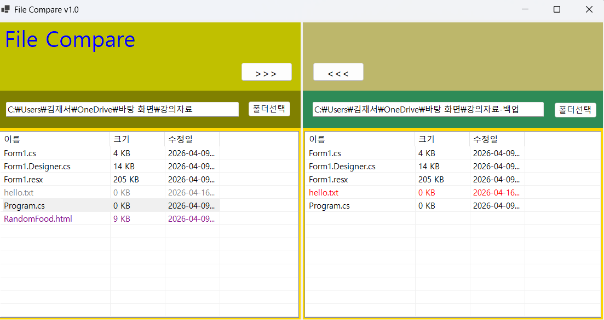

# (C# 코딩) FileCompare

## 개요
- C# 프로그래밍 학습
- 1줄 소개: 2개의 폴더를 선택하여 파일의 상태를 비교하고, 양방향으로 파일을 복사할 수 있는 Windows Forms 애플리케이션
- 사용한 플랫폼: 
	- C#, .NET Windows Forms, Visual Studio, GitHub
- 사용한 컨트롤:
	- ListView (lvwLeftDir, lvwRightDir)
		- 파일 및 폴더의 상세 정보(이름, 크기, 수정일)를 출력하는 메인 UI입니다.
		- View 속성을 Details로 설정하고 FullRowSelect를 통해 행 단위 선택이 가능하게 구현했습니다.
	- FolderBrowserDialog
		- 사용자가 로컬 시스템에서 비교 및 복사할 폴더 경로를 안전하게 선택할 수 있도록 지원합니다.
	- TextBox (txtLeftDir, txtRightDir)
		- 선택된 폴더의 전체 경로를 표시하고, 하위 로직에서 경로 참조 데이터로 활용합니다.
	- Button (btnCopyLeft, btnCopyRight 등)
		- 폴더 선택 및 양방향 복사(<<<, >>>) 이벤트를 발생시키는 트리거 역할을 합니다.
	- MessageBox
		- 파일 덮어쓰기 전 날짜 비교 정보를 출력하고 사용자의 최종 승인(Yes/No)을 받는 인터페이스입니다.
- 사용한 기술과 구현한 기능: 
	- 파일 시스템 제어 (System.IO 활용)
		- DirectoryInfo와 FileInfo 클래스를 사용하여 파일의 메타데이터(크기, 수정 시간 등)를 추출하고 관리했습니다.
	- 재귀적 디렉터리 복사 (Recursive Directory Copy)
		- 하위 폴더 선택 시, 해당 구조 내의 모든 파일과 서브 폴더를 동일하게 복제하기 위해 자기 자신을 호출하는 재귀 알고리즘을 구현했습니다.
	- 데이터 정렬 및 행 맞춤 (Data Alignment)
		- SortedSet을 활용해 양쪽 폴더의 전체 항목을 알파벳순으로 통합 정렬했습니다.
		- 한쪽에만 존재하는 항목은 반대편에 빈 아이템을 삽입하여, 동일 파일이 항상 같은 행에 위치하도록 시각적 동기화를 구현했습니다.
	- 조건부 포맷팅 (Conditional Formatting)
		- 파일의 수정 시간을 비교하여 최신(Red), 이전(Gray), 단독(Purple), 동일(Black) 상태를 색상별로 다르게 표시해 시각적 가독성을 높였습니다.
	- 오차 허용 시간 비교 로직 (Time Tolerance)
		- 복사 과정에서 발생하는 미세한 시간 차이(밀리초 단위)를 무시하기 위해 TimeSpan 또는 초 단위 비교를 적용, 복사 직후 상태가 정확히 '동일(Black)'로 표시되도록 예외 처리를 수행했습니다.
	- UI 업데이트 최적화
		- 대량의 파일 목록을 갱신할 때 발생하는 화면 깜빡임을 방지하기 위해 BeginUpdate()와 EndUpdate() 메서드를 사용하여 렌더링 성능을 개선했습니다.
	

## 실행 화면 (과제1)
- 코드의 실행 스크린샷과 구현 내용 설명

- 구현한 내용 (위 그림 참조)
	- 이중 구조 레이아웃: 좌측(Source)과 우측(Destination)으로 영역을 나누어 두 폴더의 상태를 동시에 비교할 수 있는 대칭형 UI를 구현하였습니다.
	- 파일 정보 가독성 확보: ListView 컨트롤을 활용하여 단순 파일명뿐만 아니라 파일의 크기와 마지막 수정 날짜를 열(Column) 단위로 정렬하여 표시되도록 기초 설계를 마쳤습니다.
	- 상태 표시 기능: 각 폴더의 경로를 표시하는 상단 텍스트 박스를 통해 현재 프로그램이 참조하고 있는 디렉터리 정보를 실시간으로 확인할 수 있게 하였습니다.
	
## 실행 화면 (과제2)
- 코드의 실행 스크린샷과 구현 내용 설명

- 구현한 내용 (위 그림 참조)
	- 실시간 파일 비교 시스템: 양쪽 폴더가 모두 선택되는 순간, 각 파일의 **이름(Name)**과 **수정 시간(LastWriteTime)**을 대조하여 실시간으로 상태를 분석합니다.
	- 수업 자료 기준 상태별 색상 구현:
		- 동일 파일 (Black): 양쪽 폴더에 파일이 존재하고 수정 시간이 일치하는 경우
		- 최신 파일 (Red): 상대 폴더의 동일 파일보다 수정 시간이 늦은(New) 경우
		- 이전 파일 (Gray): 상대 폴더의 동일 파일보다 수정 시간이 빠른(Old) 경우
		- 단독 파일 (Purple): 상대 폴더에 존재하지 않는 파일인 경우
	- 데이터 최적화: FileInfo 클래스를 통해 파일 크기를 KB 단위로 환산하고, BeginUpdate()/EndUpdate()를 사용하여 목록 갱신 시 화면 떨림을 방지했습니다.

## 실행 화면 (과제3)
- 코드의 실행 스크린샷과 구현 내용 설명

- 구현한 내용 (위 그림 참조)
	- 양방향 파일 복사 기능: >>> (왼쪽에서 오른쪽) 및 <<< (오른쪽에서 왼쪽) 버튼을 구현하여 선택한 파일을 반대편 폴더로 간편하게 복사할 수 있도록 했습니다.
	- 파일 덮어쓰기 안전장치: 대상 폴더에 동일한 이름의 파일이 이미 존재할 경우, MessageBox를 호출하여 사용자에게 진행 여부를 묻는 확인 절차를 추가했습니다.
	- 시각적 데이터 비교: 확인 창 메시지에 **[보내는 파일]**과 **[기존 파일]**의 마지막 수정 날짜(LastWriteTime)를 함께 표시하여, 사용자가 어느 쪽이 더 최신 파일인지 즉시 판단하고 결정을 내릴 수 있도록 UX를 개선했습니다.
	- 다중 파일 처리 및 자동 갱신: 여러 개의 파일을 한 번에 선택하여 복사할 수 있는 기능을 지원하며, 복사가 완료된 후에는 리스트를 즉시 다시 그려 파일 상태(색상)가 실시간으로 업데이트되도록 구현했습니다.

## 실행 화면 (과제4)
- 코드의 실행 스크린샷과 구현 내용 설명

- 구현한 내용 (위 그림 참조)
	- 하위 폴더 재귀적 복사 (Recursive Copy): 폴더 선택 시 해당 폴더 내부의 모든 하위 폴더와 파일을 동일한 구조로 반대편에 복사하는 재귀 알고리즘을 구현했습니다.
	- 양쪽 리스트 행 맞춤 (Alignment): 양쪽 폴더의 모든 항목 이름을 수집 및 정렬하여, 동일한 파일은 같은 줄(Row)에 위치하게 하고 한쪽에만 존재하는 파일은 반대편을 빈칸으로 처리하여 시각적 비교 효율을 극대화했습니다.
	- 통합 복사 확인 시스템 (과제 3 요건 강화):
		- 복사 실행 전, 원본과 대상의 **마지막 수정 시간(HH:mm:ss)**을 초 단위까지 정밀하게 비교하여 MessageBox로 출력합니다.
		- 사용자가 정보를 확인한 후 덮어쓰기 여부를 직접 결정할 수 있도록 설계했습니다.
	- 폴더 상태 가시성 개선:
		- 폴더의 경우 복사 완료 후 즉시 **검은색(동일 상태)**으로 표시되도록 로직을 조정하여 사용자에게 작업 완료를 명확히 인지시킵니다.
		- 파일의 경우 복사 과정에서 발생하는 미세한 시간 오차(2초 이내)를 허용하도록 설계하여 불필요한 색상 오류(빨간색/회색 역전)를 방지했습니다.