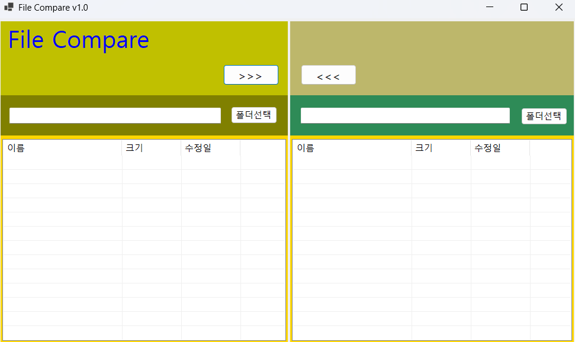

# (C# 코딩) FileCompare

## 개요
- C# 프로그래밍 학습
- 1줄 소개: 사용자 키보드 입력을 받아서 처리하는 프로그램
- 사용한 플랫폼: 
	- C#, .NET Windows Forms, Visual Studio, GitHub
- 사용한 컨트롤:
	- 
- 사용한 기술과 구현한 기능: 
	- 
	

## 실행 화면 (과제1)
- 코드의 실행 스크린샷과 구현 내용 설명

- 구현한 내용 (위 그림 참조)
	- 이중 구조 레이아웃: 좌측(Source)과 우측(Destination)으로 영역을 나누어 두 폴더의 상태를 동시에 비교할 수 있는 대칭형 UI를 구현하였습니다.
	- 파일 정보 가독성 확보: ListView 컨트롤을 활용하여 단순 파일명뿐만 아니라 파일의 크기와 마지막 수정 날짜를 열(Column) 단위로 정렬하여 표시되도록 기초 설계를 마쳤습니다.
	- 상태 표시 기능: 각 폴더의 경로를 표시하는 상단 텍스트 박스를 통해 현재 프로그램이 참조하고 있는 디렉터리 정보를 실시간으로 확인할 수 있게 하였습니다.
	
## 실행 화면 (과제2)
- 코드의 실행 스크린샷과 구현 내용 설명

- 구현한 내용 (위 그림 참조)
	- 

## 실행 화면 (과제3)
- 코드의 실행 스크린샷과 구현 내용 설명

- 구현한 내용 (위 그림 참조)
	- 

## 실행 화면 (과제4)
- 코드의 실행 스크린샷과 구현 내용 설명

- 구현한 내용 (위 그림 참조)
	- 